# Workflows

## Lead to sale

```mermaid
flowchart LR
  Wix["Wix CTA / form"] --> Intake["Workspace intake"]
  Intake --> Filter["Hard filters"]
  Filter --> Score["3 product scores"]
  Score --> Qualify["AI qualification"]
  Qualify --> Research["Company + contact research"]
  Research --> Draft["Gmail draft"]
  Draft --> Follow["Day 3 / 7 / 14"]
  Follow --> Intent["HOT / WARM / LATER / NO"]
  Intent --> Meeting["Meeting"]
  Meeting --> Proposal["Proposal / quote"]
  Proposal --> Outcome{"Won?"}
  Outcome -->|Yes| Delivery["Onboarding + milestones"]
  Outcome -->|No| Nurture["Lost reason / nurture"]
  Delivery --> Renewal["Upsell / renewal"]
```



## State transitions

```yaml
new: [qualified, lost]
qualified: [research, lost]
research: [contacted, lost]
contacted: [replied, meeting, lost]
replied: [meeting, contacted, lost]
meeting: [proposal, lost]
proposal: [won, lost]
won: [won]
lost: [qualified, lost]
```

The UI allows manual correction of a stage. Every automatic or manual transition writes an audit event.

## Follow-up scheduling

The V1 application creates due records for Day 3, 7, and 14. It does not send email automatically. A future server scheduler may create notifications or approved Gmail drafts, but must stop the sequence on `HOT`, `WARM`, `LATER`, `NO`, meeting booking, won, lost, or unsubscribe as configured.

## Delivery handoff

Winning a deal creates four default milestones: kickoff/access, requirements/assets/data, Pilot delivery, and acceptance/roadmap. It also sets a 90-day renewal review. Milestones are workspace-scoped and auditable.

## Existing product workflows

- Agent run: prompt → `/api/agents/run` → Gemini or DeepSeek → result → workspace-scoped run history.
- Video analysis: URL/metadata → remote worker when configured → local fallback → report/PDF.
- Video generation: script + 3–5 images + optional music → worker → MP4.
